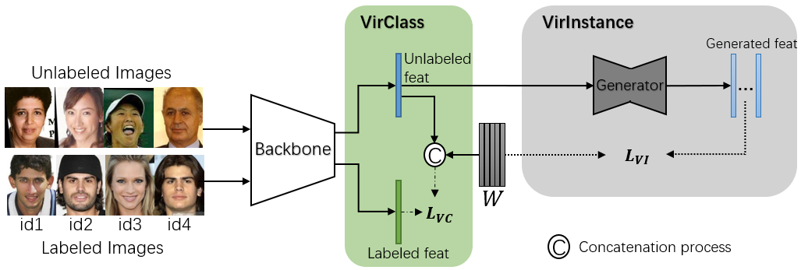

# VirFace

This is a PyTorch implementation of "**VirFace: Enhancing Face Recognition via Unlabeled Shallow Data**" _(CVPR 2021)_.
****

### **Training stage**

   <table border="2">
      <tr>
         <td style="text-align: center; vertical-align: middle; border-bottom: double"><b>Training Stage</b></td>
         <td style="text-align: center; vertical-align: middle; border-bottom: double"><b>Datasets</b></td>
         <td style="text-align: center; vertical-align: middle; border-bottom: double"><b>args.method</b></td>
         <td style="text-align: center; vertical-align: middle; border-bottom: double"><b>pretrain model needed</b></td>
      </tr>
      <tr>
         <td style="text-align: center; vertical-align: middle;">Pre-train backbone</td>
         <td style="text-align: center; vertical-align: middle;">Label</td>
         <td style="text-align: center; vertical-align: middle;">pretrain</td>
         <td style="text-align: center; vertical-align: middle;">None</td>
      </tr>
      <tr>
         <td style="text-align: center; vertical-align: middle;">Pre-train generator</td>
         <td style="text-align: center; vertical-align: middle;">Label</td>
         <td style="text-align: center; vertical-align: middle;">generator</td>
         <td style="text-align: center; vertical-align: middle;">backbone, head</td>
      </tr>
      <tr>
         <td style="text-align: center; vertical-align: middle;">Training VirClass</td>
         <td style="text-align: center; vertical-align: middle;">Label &amp; Unlabel</td>
         <td style="text-align: center; vertical-align: middle;">virclass</td>
         <td style="text-align: center; vertical-align: middle;">backbone, head</td>
      </tr>
      <tr>
         <td style="text-align: center; vertical-align: middle;">Training VirFace</td>
         <td style="text-align: center; vertical-align: middle;">Label &amp; Unlabel</td>
         <td style="text-align: center; vertical-align: middle;">virface</td>
         <td style="text-align: center; vertical-align: middle;">backbone, head, generator</td>
      </tr>
   </table>

### **Backbone model**

   <table border="2">
      <tr>
         <td style="text-align: center; vertical-align: middle; border-right: double" rowspan="2"><b>Arch</b></td>
         <td style="text-align: center; vertical-align: middle;" colspan="5">ResNet</td>
         <td style="text-align: center; vertical-align: middle;" rowspan="2">User Arch</td>
      </tr>
      <tr>
         <td style="text-align: center; vertical-align: middle;">18</td>
         <td style="text-align: center; vertical-align: middle;">34</td>
         <td style="text-align: center; vertical-align: middle;">50</td>
         <td style="text-align: center; vertical-align: middle;">101</td>
         <td style="text-align: center; vertical-align: middle;">152</td>
      </tr>
      <tr>
         <td style="text-align: center; vertical-align: middle; border-right: double"><b>args.arch</b></td>
         <td style="text-align: center; vertical-align: middle;">resnet18</td>
         <td style="text-align: center; vertical-align: middle;">resnet34</td>
         <td style="text-align: center; vertical-align: middle;">resnet50</td>
         <td style="text-align: center; vertical-align: middle;">resnet101</td>
         <td style="text-align: center; vertical-align: middle;">resnet152</td>
         <td style="text-align: center; vertical-align: middle;">usr</td>
      </tr>
   </table>
   - How to use **user modified architecture**:
  
   > - edit _config.py_: import modified *'.py'* file, then modifiy "_model_usr=None_" to "_model_usr=%filename.%modelname(%params)_"
   > - **Note:** the user modified architecture should not contain any classification FC layer(_e.g._ the last FC layer in ArcFace). The output should be an embedding feature.

### **Usage**
 - _Pretrain_

 ```shell
    python3 train.py --method pretrain
    python3 train.py --method generator --pretrain_file %backbone_path
 ```

 **Note**: 'pretrain' means training backbone(contraining head params) and save [backbone, head] model; 'generator' means training generator and save [backbone, head, generator] models. 
 - _Training from scrach_

    - **VirClass**

    ```shell
       python3 train.py --method pretrain
       python3 train.py --method virclass --pretrain_file %backbone_path
    ```

    - **VirFace**

    ```shell
       python3 train.py --method pretrain
       python3 train.py --method generator --pretrain_file %backbone_path
       python3 train.py --method virface --pretrain_file %generator_path
    ```
 - _Trainingfrom pretrained model_
    - **VirClass** 

    ```shell
       python3 train.py --method virclass --pretrain_file %backbone_path
    ```

    - **VirFace**

    ```shell
       python3 train.py --method virface --pretrain_file %generator_path
    ```
    **Note**: this pretrained file should contain [backbone, head, generator]

 - _Arguments setting_
    > **method:** choose training stage. [pretrain, generator, virclass, virface]
    >
    > **label_batch_size:** label data batch size.
    >
    > **unlabel_batch_size:** unlabel data batch size.
    >
    > **arch:** choose architecture of backbone. [resnet18, resnet34, resnet50, resnet101, resnet152, usr]
    >
    > **feat_len:** length of embedding feature.
    >
    > **num_ids:** number of identities in labeled dataset.
    >
    > **gen_num:** the number of generated features via generator.
    >
    > **KL:** weight of KL loss.
    >
    > **L2:** weight of MSE loss.
    >
    > **resume:** resume flag.
    >
    > **resume_file:** resume checkpoint path.
    >
    > **pretrained_file:** pretrained checkpoint path. This is necessary if method is not "pretrain".
    >
    > **tensorboard:** use tensorboard or not.
    >
    > **snapshot_prefix:** path to save checkpoint.
    >
    > **eval:** whether evaluate for each epoch on LFW, CFP-FF, CFP-FP

### **Citation**

If our paper helps your research, please cite it in your publications:
```
@inproceedings{li2021virface,
  title={VirFace: Enhancing Face Recognition via Unlabeled Shallow Data},
  author={Li, Wenyu and Guo, Tianchu and Li, Pengyu and Chen, Binghui and Wang, Biao and Zuo, Wangmeng and Zhang, Lei},
  booktitle={Proceedings of the IEEE/CVF Conference on Computer Vision and Pattern Recognition},
  pages={14729--14738},
  year={2021}
}
```
